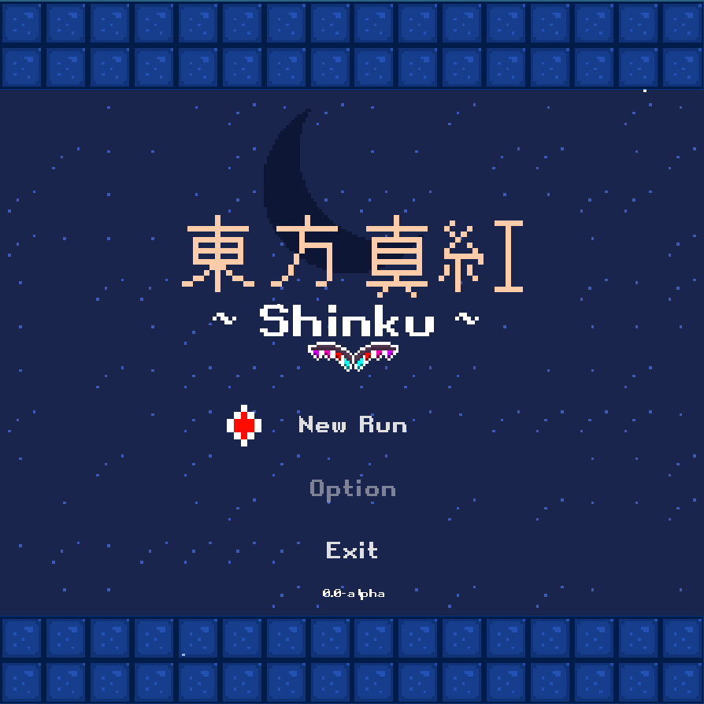

# Touhou: Shinku (東方: 真紅)

- [Overview](#overview)
- [About Touhou](#about-touhou-project)
- [Installation](#installation)
- [Development](#development)



## Overview

Touhou: Shinku is an open source **fan-game** set in world of [Touhou Project](https://en.wikipedia.org/wiki/Touhou_Project).
It is top-down vertical-scrolling curtain of fire shooting game (STG) also known as "Bullet hell" or "Danmaku".
STGs are fast-paced games focused around pattern recognition and mastery through practice.
Touhou: Shinku focus on Boss Rush featuring Flandre Scarlet and Koishi Komeiji

Touhou: Shinku is written mostly in Rust inside Godot Engine v4.6 while the gameplay and UI is written in GDScript.
This will avoid most of the performance bottleneck around dealing many entities.

## About Touhou Project

Touhou Project is an indie game series (also known as "doujin" in Japanese)
known for its ensemble cast of characters and memorable soundtracks.
It is produced by and large by a single artist known as ZUN, and has a
[permissive license](https://en.touhouwiki.net/wiki/Touhou_Wiki:Copyrights#Copyright_status.2FTerms_of_Use_of_the_Touhou_Project>)
which allows for indie derivative works such as Kurai Project to legally exist.

Touhou: Shinku is *not* a "clone" of Touhou Project, and tells an original story with its own
music, art, gameplay mechanics, and codebase. While some familiarity with Touhou
is helpful, the gameplay can be enjoyed on its own without prior knowledge of
the series.

For more information on dōjin culture,
[click here](https://en.wikipedia.org/wiki/D%C5%8Djin).

## Installation

*Currently in development but you may clone the project and run the game, see more in [Development](#development)*

## Development

You will need
- Godot Engine v4.6
- Rust nightly toolchain v1.92
- emcc (for web build)

Start by cloning the repository
```sh
git clone https://github.com/UnknownRori/touhou-shinku
```

and open the project with your favorite editor and Godot Engine editor

See Godot Rust integration here: [https://godot-rust.github.io/book/index.html](https://godot-rust.github.io/book/index.html)
